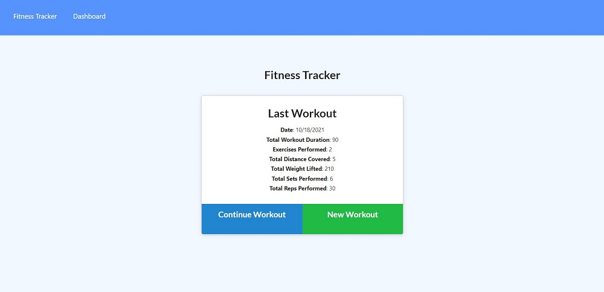
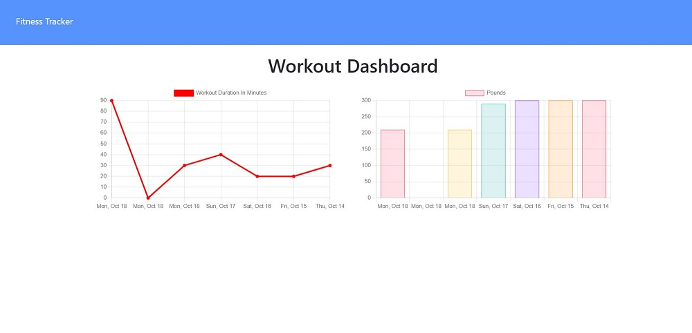
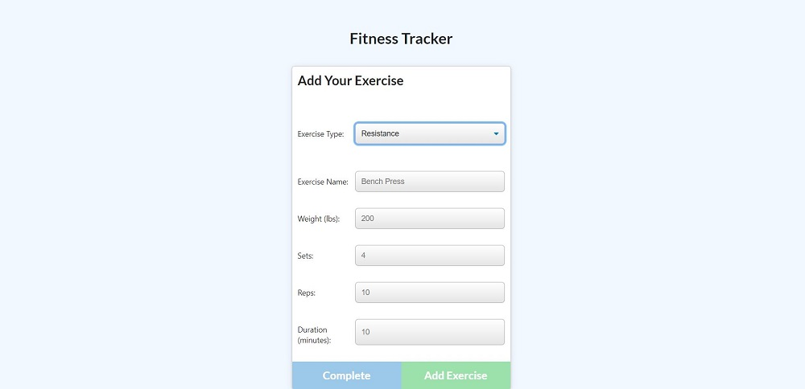

# nosql-workout-tracker

## Description
Designed the back end for a fitness tracker site by creating a Mongo database with a Mongoose schema and handle routes with Express.

## User Story
AS A user

I WANT to be able to view create and track daily workouts.

I WANT to be able to log multiple exercises in a workout on a given day.

SO THAT track the name, type, weight, sets, reps and duration of exercise, and if the exercise is a cardio exercise, should be able to track my distance traveled.

## Table Of Contents
* [Links](#links)

* [Installation](#installation)

* [Instructions](#instructions)

* [Screenshots](#screenshots)

* [License](#license)

## Links
[GitHub Repo](https://github.com/asantercureton/nosql-workout-tracker)

[Heroku Deploy](https://nosql-workout-tracker-10132021.herokuapp.com/)

## Installation
Run "npm install" at root directory

Then run "npm run seed"

## Instructions
Run "npm start" to intiate the application.

## Screenshots
Below is a screenshot of the project:

## License

---
© 2021 NoSQL Workout Tracker App.